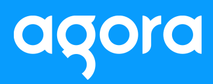

# Design Battle Live!

Official contest rules and details for the 6/29/2022 design battle hosted by [Dennis Ivy](https://twitter.com/dennisivy11) and [Gary Simon](https://twitter.com/designcoursecom).

View stream [here](#)

## Sponsored by [Agora](https://twitter.com/AgoraIO)

## How to participate

1. Join [Design Course discord server](https://discord.gg/svBRy64t) and go to the #hackathon channel
1. Receive project specs at 11am EST in discord server
1. Post public figma link in discord server (#hackathon) so Gary and Dennis can track progress live
1. Complete Design by 1:00pm EST (2Hrs)

Contest will officially start at 11am (EST) and live stream will start on youtube at 12pm (EST). To participate be sure to join the [Design Course discord server](hhttps://discord.gg/svBRy64t) by start time (11am) and wait for further instructions.

At 11am participants will be given a hypothetical page to design. Participants will use figma to create designs and will provide public links in the server so Dennis and Gary can view during the live stream. Total time to design will be 2hrs.

## Prizes

- 1st place: $700
- 2nd place: $500
- 3rd place: $300

## Contest Itinerary

Note: All times represented in Eastern Standard Timezone

- 11am: Contest challenge announced
- 12pm: Dennis and Gary go live on youtube.
- 1:15pm: Winners announced 