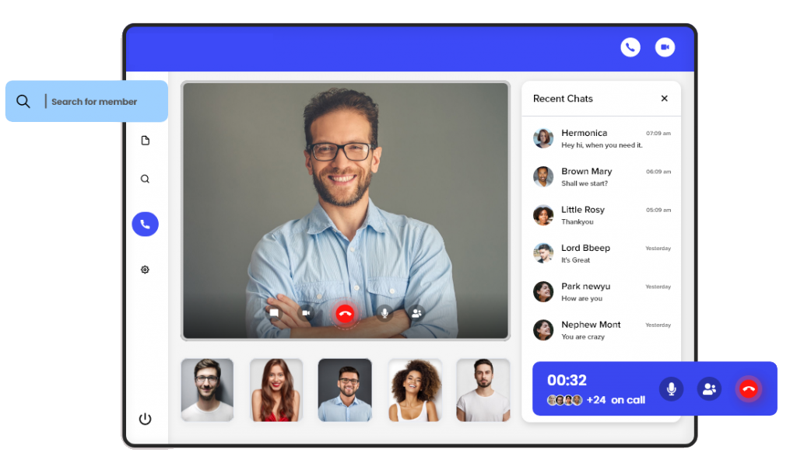
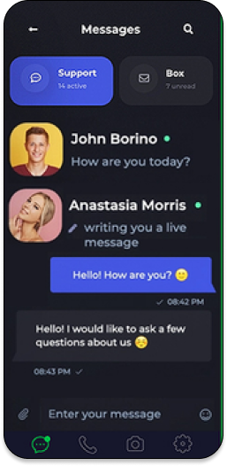

# Design Battle Live!

Official contest rules and details for the 6/30/2022 design battle hosted by [Dennis Ivy](https://twitter.com/dennisivy11) and [Gary Simon](https://twitter.com/designcoursecom).

View stream [here](https://www.youtube.com/watch?v=n2i4D62mIDE)

## Sponsored by [Agora](https://twitter.com/AgoraIO)

## How to participate

1. Join [Design Course discord server](https://discord.gg/svBRy64t) and go to the #hackathon channel
1. Post public figma link in discord server (#hackathon) so Gary and Dennis can track progress live.
1. Design page based on description in the "Problem Set" section bellow. This will be posted at 11:00am EST on 6/30/2022
1. Complete Design by 1:00pm EST (2Hrs)
1. Wait for results to be announce live via [youtube live stream](https://www.youtube.com/watch?v=n2i4D62mIDE)

Contest will officially start at 11am (EST) and live stream will start on youtube at 12pm (EST). To participate be sure to join the [Design Course discord server](hhttps://discord.gg/svBRy64t) by start time (11am) and wait for further instructions.

At 11am participants will be given a hypothetical page to design. Participants will use figma to create designs and will provide public links in the server so Dennis and Gary can view during the live stream. Total time to design will be 2hrs.

## Prize Money

- 1st place: $700
- 2nd place: $500
- 3rd place: $300

## Contest Itinerary

Note: All times represented in Eastern Standard Timezone

- 11am: Contest challenge announced - Dennis will start pre-stream event.
- 12pm: Dennis and Gary go live on youtube.
- 1:15pm: Winners announced 

## Problem Set

This will be posted at 11am EST on 6/30/2022

<!-- 

Ok so the task at hand is revealed! Since Agora is the sponsor of this video we will create a landing page promoting Agora and two of their products. The Agora RTC and RTM SDK. This will be a ONE page design.

I will provide all the content below, your job will be to piece this together using Figma (or XD). It's up to your discretion to use whatever content you want wish and how you piece together the layout along with color schemes. 

Note: Ask any questions you may have in the #hackathon-questions channel in the discord server. If you need to reference the agora website you can find it at [agora.io](https://www.agora.io/en/)

## Suggested Page Content

**Agora Primary Brand Color**
Color: rgba(9, 157, 253, 1)

**Agora Logo**
 
 

**Headline:** "Build real Time Communication
into Your apps"

Sub-headline: "SDK for Voice, Video, Real Time Data Signaling and more"

**Description:** "Agora is a real time engagement platform as a services. Its a fancy way of saying we saying provide you with all the backend infrastructure along with all the ways for your application to enable real time voice video and messaging in your applications."

### Agora Products:

**Agora RTC:** Voice and Video with Agora RTC

**Agora RTM:** Real Time Data Signaling with Agora RTM

Note: use `Lorem Ipsum` text for product descriptions if you wish to add any.

**Optional Images**

Try usings these images or something simular. Feel free to find stock photos if you think you have better options.

**Agora RTC Descriptive image**
 
 

**Agora RTM Descriptive image**
 
 

## Sample Design

I have created a quick mockup if you need some inspiration or clarifications of what you need to build.
 

-->